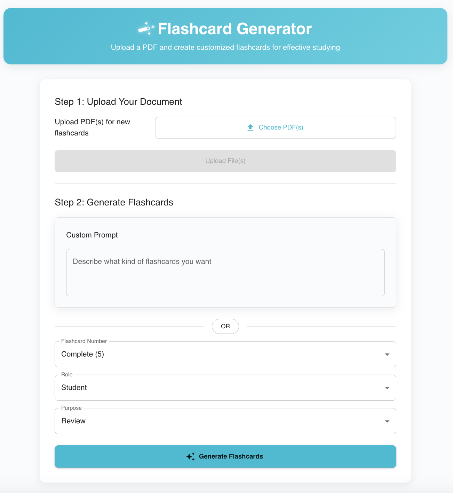

# Flashcard Generator



## Description

The Flashcard Generator is an AI-powered application that allows users to generate flashcards from uploaded PDF files. The app processes structured text, extracts keywords and entities, and generates relevant question-answer pairs to aid learning. This project is designed to run locally without cloud dependency and is integrated with Qualcomm technologies for optimized on-device inference.

## Developers & Contact

- **[Junjie Li]** - alvinbluy@gmail.com
- **[Hui Zhou]** - zhouhui2023cs@gmail.com
- **[Meredith Luo]** - meredithluo710@gmail.com
- **[Rouming Zhang]** - lotus20210417@gmail.com
- **[Tiantian Huang]** - huangtiantian0430@gmail.com


## Backend and Frontend Links

- Backend: https://github.com/takkujunjieli/flashcard-backend main branch
- Frontend: https://github.com/mereluo/flashcard-generator main branch

## Setup Instructions

Contact us if you have any questions about the setup

Prerequisites

Ensure you have the following dependencies installed:

```
Python 3.8+
Node.js (>= 14.0.0)
npm (>= 6.0.0)
```

## Backend Installation

Clone the repository:

```
git clone https://github.com/your-repo/flashcard-backend.git
cd flashcard-backend
```

Create a virtual environment:

```
python -m venv venv
source venv/bin/activate  # On Windows use `venv\Scripts\activate`
```

Install dependencies:

```
pip install -r requirements.txt
```

Download necessary NLP models:

```
python -m nltk.downloader punkt
python -m spacy download en_core_web_sm
```

Start the FastAPI server:
```
uvicorn main:app --reload
```

The API will be available at http://127.0.0.1:8000

## Frontend Installation

Clone the repository:

```
git clone https://github.com/your-username/flashcard-generator.git
cd flashcard-generator
```

Install dependencies:

```
npm install
```

Running the Application

```
npm run dev
```

## Usage

1. Upload a PDF to generate flashcards automatically.
2. Choose the selected type of card number, role and purpose, or customize your flashcard generation prompt.
3. Edit flashcards using the interactive editor.
4. Navigate through flashcards using the carousel or list view.
